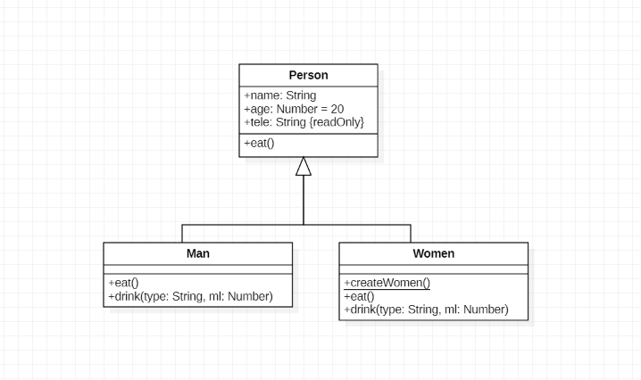
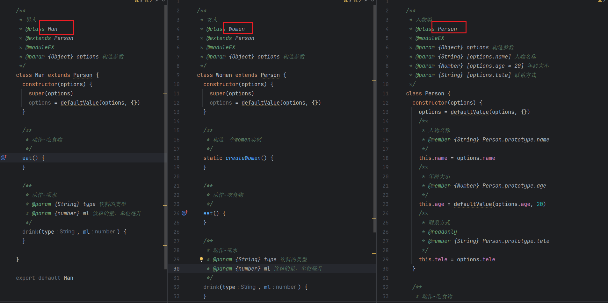

# python-starUML ToJS
Converting the starUML  Pciture to JS Class Text  in bulk.

starUML 图批量转前端JS对象一键脚本

左图为uml，右图为转换后的JS ES6 Class类

|                                                              |                                                              |
| ------------------------------------------------------------ | ------------------------------------------------------------ |
|  |  |

## 使用说明

将StarUML mdj文件放于main.py同级目录下，运行脚本，在同级目录下生成和mdj文件同名的文件夹，文件夹内存放有生成好的JS文件。


## 便捷使用
打包为exe
```text
pyinstaller -F main.py
```
将mdj文件 和 exe放置于同一目录下，执行exe即可


## 版本

| Package | Version       |
| ------- | ------------- |
| starUML | 3.3.2 or high |
| python  | 3.9 or high   |


